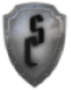
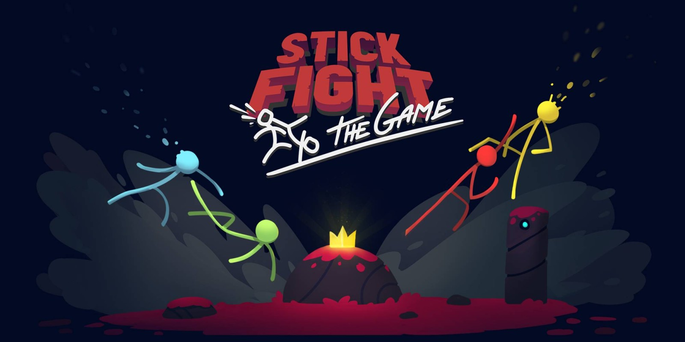
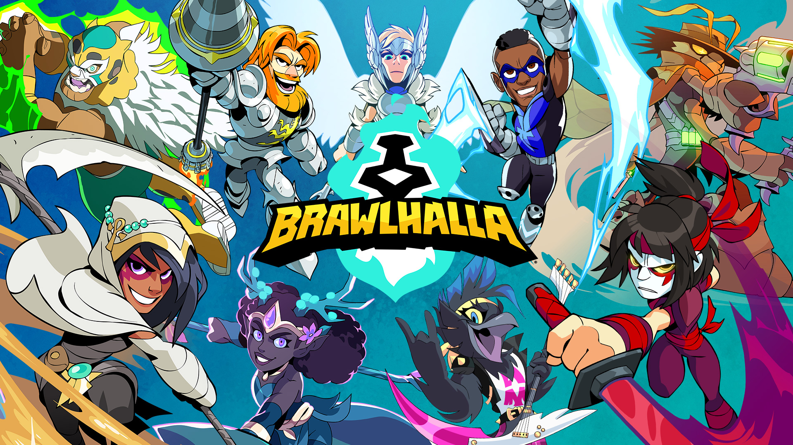
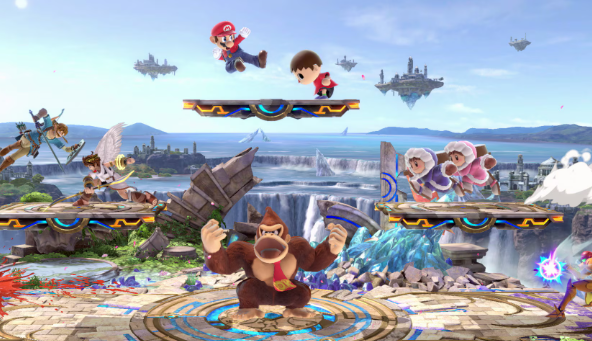
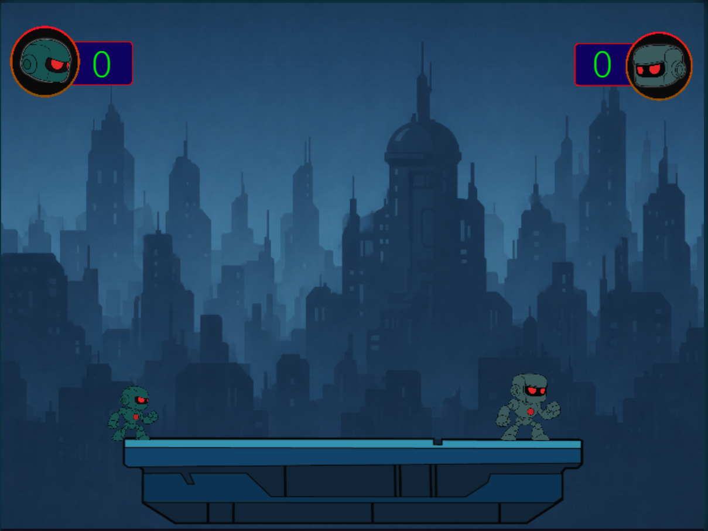
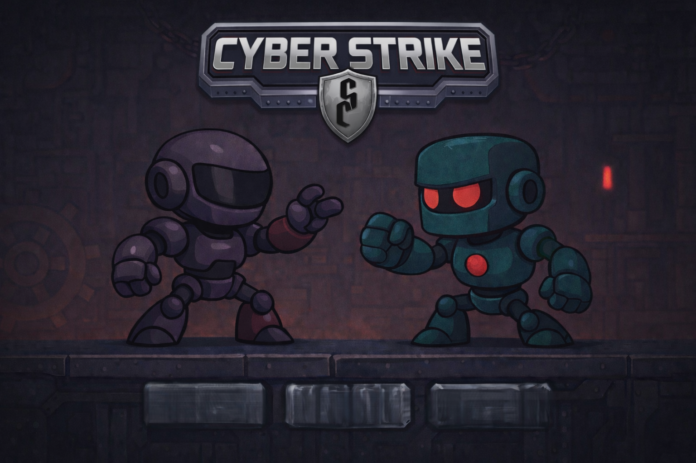
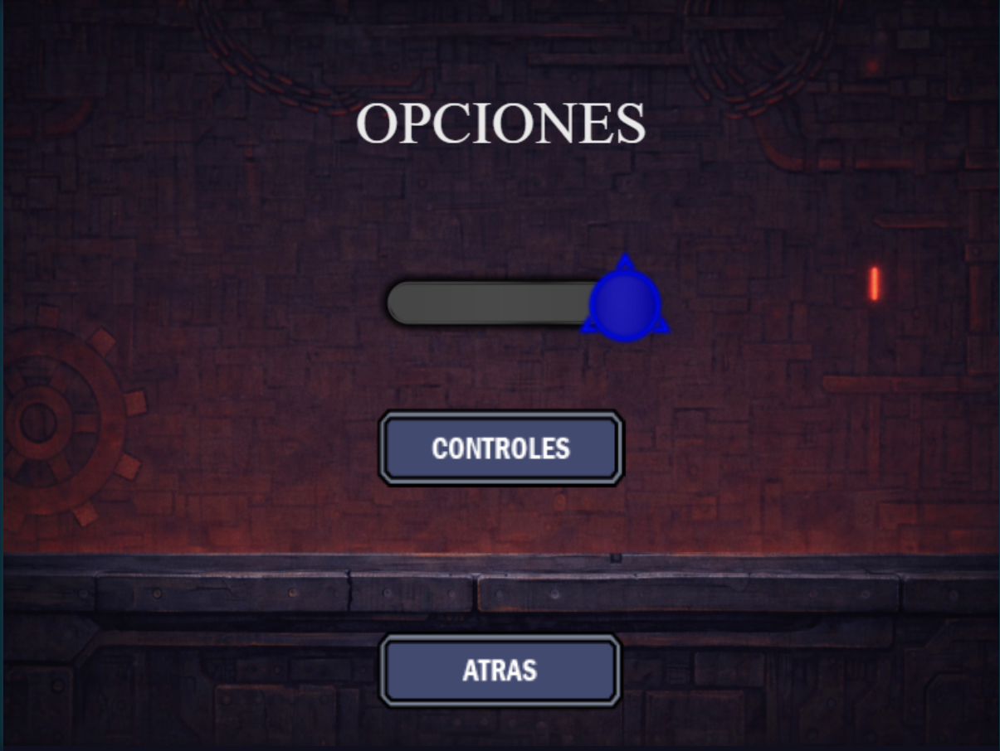
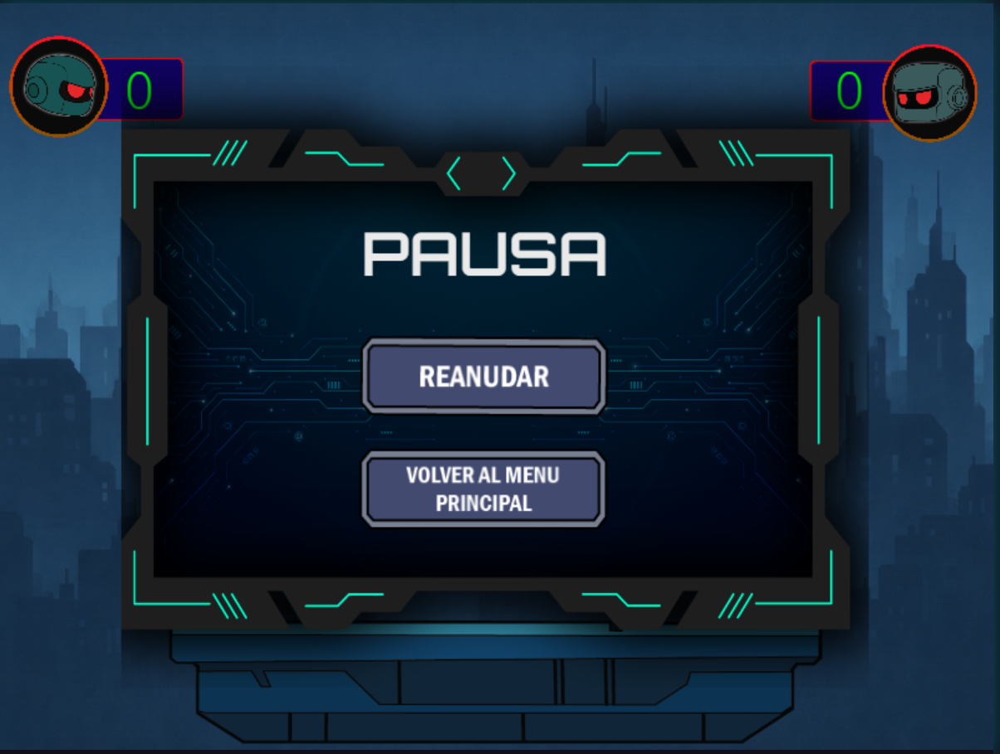
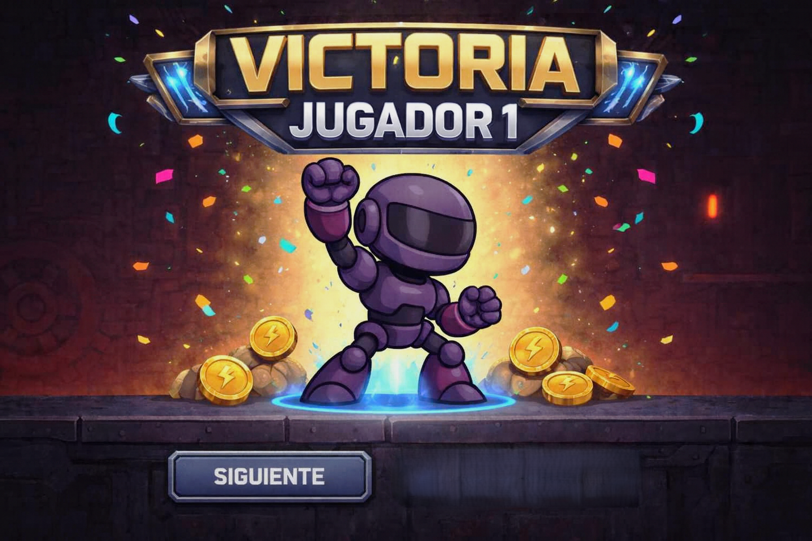
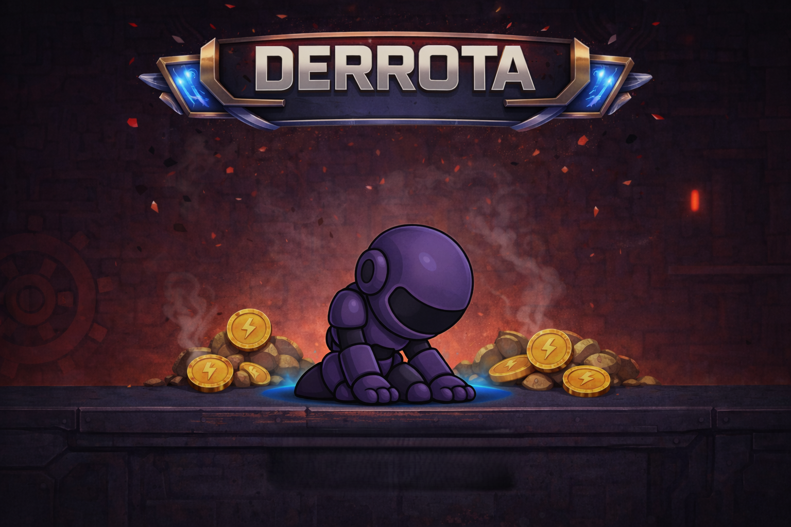

# 🕹️ Game Design Document – Cyber Strike

---

## 👥 Integrantes
- **Jairo Torrijo Martín**
- **Luciano Manuel Picholis**
- **Mauricio Pucciariello**

Todos los integrantes participaron activamente en el desarrollo del juego, la implementación del multijugador online, el diseño de escenas, la lógica de red y la documentación.

---

## 1️⃣ Concepto General
**Cyber Strike** es un videojuego de combate **1v1 en 2D**, con una estética futurista cartoon, enfocado en partidas rápidas y competitivas.

El objetivo del juego es derribar al oponente fuera de la plataforma mediante empujes, ataques estratégicos y el uso inteligente del espacio.

---

## 2️⃣ Género e Inspiraciones
- **Género:** Combate 2D / Arena Fighter
- **Inspiraciones:**
  - Stick Fight: The Game  
  - Brawlhalla  
  - Super Smash Bros.

---

## 3️⃣ Plataforma y Público Objetivo
- **Plataforma:** PC (Windows, MacOS, Linux)
- **Público objetivo:** jugadores de 15 a 25 años
- **Modos de juego:** local y multijugador online

---

## 4️⃣ Gameplay
Las partidas son cortas, dinámicas y frenéticas, con una duración aproximada de **1 a 2 minutos**.

El jugador debe empujar y atacar al rival hasta hacerlo caer del escenario.  
El entorno y la física juegan un rol clave en el resultado de cada enfrentamiento.

---

## 5️⃣ Mecánicas Principales
- Movimiento lateral
- Salto
- Empuje físico
- Ataques cuerpo a cuerpo
- Dash
- Power-ups temporales

---

## 6️⃣ Controles

### 🎮 Modo Local
**Jugador 1**
- Movimiento: `WASD`
- Ataque / Empuje: `E` / `F`

**Jugador 2**
- Movimiento: `OKLÑ`
- Ataque / Empuje: `I` / `J`

---

### 🌐 Modo Online
- Movimiento: `WASD`
- Salto: `Espacio`
- Ataque / Empuje: `E`
- Dash: `Shift`
- Pausa: `ESC`

---

## 7️⃣ Interfaces y Menús
El juego cuenta con las siguientes pantallas:

- Menú principal
- Selector de modo de juego
- Menú de opciones
- Menú de pausa
- Pantalla de créditos

---

## 8️⃣ HUD y Sistema de Puntuación
- Marcadores visibles en las esquinas superiores
- Indicador de jugadores
- Gana el jugador que alcanza el puntaje objetivo

---

## 9️⃣ Sonido
El juego incluye:
- Música en el menú principal
- Música durante el combate
- Efectos de sonido para ataques, empujes, selección de opciones y transiciones

---

## 🔟 Pantallas de Victoria y Derrota
Dependiendo del resultado de la partida, el jugador accede a una pantalla específica.

---

## 1️⃣1️⃣ Créditos
El juego cuenta con una pantalla de créditos dedicada donde se muestran los integrantes del equipo y su participación en el proyecto.

---

## 1️⃣2️⃣ Estado del Proyecto
El proyecto se encuentra **completamente funcional**, cumpliendo con todos los requisitos de la **Fase 3** de la asignatura **Juegos en Red (URJC)**:

- Multijugador online funcional
- Comunicación en tiempo real mediante WebSockets
- API REST operativa
- Manejo de desconexión de jugadores
- Interfaz personalizada con assets propios
- Música y efectos de sonido implementados
- Documentación actualizada
